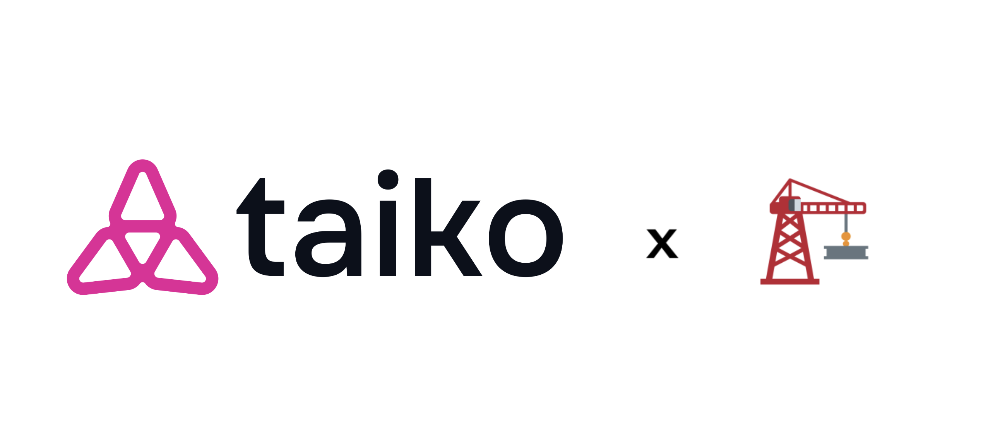

# 🏗 Scaffold-ETH-Taiko

<h4 align="center">
  <a href="https://docs.taiko.xyz">Documentation</a>
  | <a href="https://github.com/taikoxyz/scaffold-eth-taiko/issues">Report Issue</a>

</h4>

⚙️ Built using NextJS, RainbowKit, Hardhat, Wagmi, Viem, and Typescript.

-   ✅ **Contract Hot Reload**: Your frontend auto-adapts to your smart contract as you edit it.
-   🪝 **[Custom hooks](https://docs.scaffoldeth.io/hooks/)**: Collection of React hooks wrapper around [wagmi](https://wagmi.sh/) to simplify interactions with smart contracts with typescript autocompletion.
-   🧱 [**Components**](https://docs.scaffoldeth.io/components/): Collection of common web3 components to quickly build your frontend.
-   🔥 **Burner Wallet & Local Faucet**: Quickly test your application with a burner wallet and local faucet.
-   🔐 **Integration with Wallet Providers**: Connect to different wallet providers and interact with the Ethereum network.

## Requirements

Before you begin, you need to install the following tools:

-   [Node (>= v18.18)](https://nodejs.org/en/download/)
-   Yarn ([v1](https://classic.yarnpkg.com/en/docs/install/) or [v2+](https://yarnpkg.com/getting-started/install))
-   [Git](https://git-scm.com/downloads)

Visit our [docs](https://docs.taiko.xyz) to learn how to start building with Taiko.

To know more about Scaffold-ETH features, check out their [website](https://scaffoldeth.io).